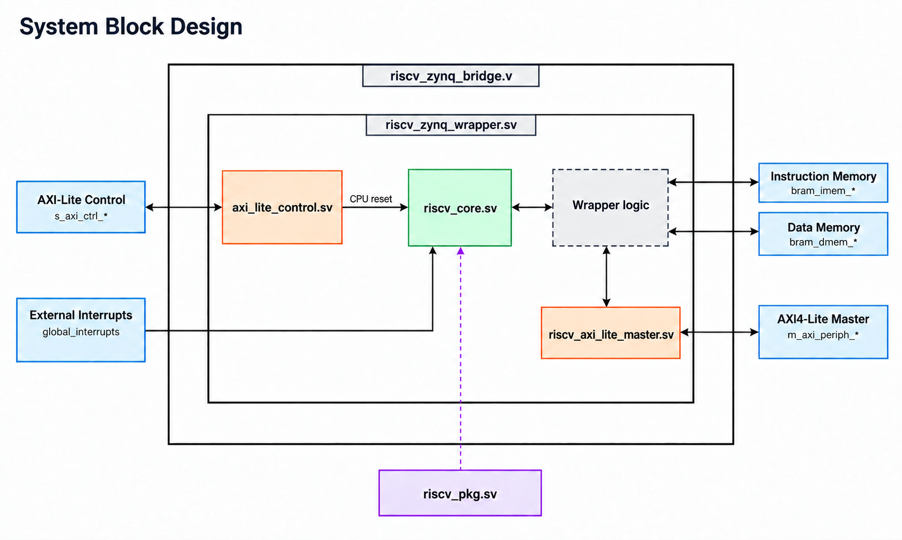
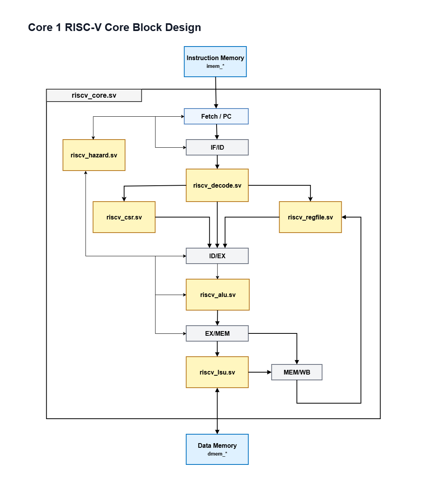

# RV32IM 5-Stage Pipelined RISC-V Core

A compact, in-order **RV32IM** processor written in SystemVerilog, designed to run
bare-metal programs out of on-chip BRAM on a Xilinx Zynq (Zybo Z7-10). The core
is verified against the **Spike** golden ISA model and in a **UVM** testbench.

> This is **Core 1** of a planned series (Core 1 = simple BRAM, Core 2 = caches,
> Core 3 = FreeRTOS). It is deliberately minimal: no caches, external interrupt only,
> machine-mode only.

---

## Block Design and Resources





FPGA resource utilization report: [core1_resources_utilization.txt](core1_resources_utilization.txt)

Full Core 1 specification: [specs/core1_specs.md](specs/core1_specs.md)

## Core Specifications

| Item | Specification |
|------|---------------|
| Core name | Core1 |
| ISA | RISC-V RV32IM |
| XLEN | 32-bit |
| Implementation language | SystemVerilog |
| Target platform | FPGA / Zynq BRAM-based system |
| Pipeline | 5-stage, in-order |
| Memory architecture | Separate instruction and data BRAM interfaces |
| Privilege support | Machine-mode CSR/trap subset |
| Interrupts | Machine external interrupt only |

| Feature | Support |
|---------|---------|
| Base integer ISA | RV32I supported |
| Register file | 32 integer registers, `x0`-`x31` |
| `x0` behavior | Hardwired to zero |
| Instruction width | 32-bit instructions only |
| Endianness | Little-endian load/store byte lanes |
| Compressed extension | Not supported |
| Multiply/divide extension | RV32M supported |
| Atomic extension | Not supported |
| Floating-point extension | Not supported |

---

## 1. Pipeline — 5 stages

```
IF  ->  ID  ->  EX  ->  MEM  ->  WB
```

| Stage | Does |
|-------|------|
| **IF** (fetch)   | drives the PC, fetches the instruction from IMEM |
| **ID** (decode)  | decodes the instruction, reads the register file, generates the immediate, reads a CSR |
| **EX** (execute) | ALU op / address calc, branch & jump resolution, CSR write & trap generation |
| **MEM** (memory) | data-memory load/store with byte strobes + load sign/zero extension |
| **WB** (write-back) | writes the result back to the register file |

**Hazard handling:**
- **Forwarding unit** — bypasses results from EX/MEM and MEM/WB back into EX, so most dependent instructions don't stall.
- **Load-use stall** — when an instruction needs a value still being loaded, the front end stalls one cycle (a bubble is inserted).
- **Control hazards** — branches/jumps resolve in **EX**; the instructions already fetched behind them are squashed via the pipeline valid bits.

The core uses a simple `req`/`ready` handshake on both memory ports, so it works
with single-cycle memory (simulation) or registered BRAM (FPGA, with a 1-cycle
handshake in the wrapper).

## 2. Instruction set

**RV32I base — all 37 integer instructions:**
- R-type: `ADD SUB SLL SLT SLTU XOR SRL SRA OR AND`
- I-type: `ADDI SLTI SLTIU XORI ORI ANDI SLLI SRLI SRAI`
- Upper:  `LUI AUIPC`
- Loads:  `LB LH LW LBU LHU`  Stores: `SB SH SW`
- Branch: `BEQ BNE BLT BGE BLTU BGEU`
- Jump:   `JAL JALR`

**RV32M multiply/divide extension:**
- Multiply: `MUL MULH MULHSU MULHU`
- Divide/remainder: `DIV DIVU REM REMU`

**Zicsr — `CSRRW CSRRS CSRRC CSRRWI CSRRSI CSRRCI`**
read/modify a CSR atomically and return its old value in `rd`.

## 3. CSRs and ECALL / EBREAK (machine mode)

The core implements a small machine-mode CSR subset for basic trap handling:

| CSR | Addr | Role |
|-----|------|------|
| `mstatus`  | 0x300 | implements `MIE`, `MPIE`, and `MPP` |
| `mtvec`    | 0x305 | trap-handler address (where ECALL/EBREAK jump) |
| `mscratch` | 0x340 | scratch register for the handler |
| `mepc`     | 0x341 | saved PC of the trapping instruction |
| `mcause`   | 0x342 | why the trap happened |
| `mtval`    | 0x343 | trap value, such as the faulting address or PC |

**Trap mechanism (`ECALL` / `EBREAK` / `MRET`):**

| Instruction | Hardware action |
|-------------|-----------------|
| `ECALL`  | `mcause = 11`, `mepc = PC`, jump to `mtvec` |
| `EBREAK` | `mcause = 3`,  `mepc = PC`, jump to `mtvec` |
| `MRET`   | return from handler: jump to `mepc` |

This is a **minimal** trap implementation: machine external interrupt is
supported, but timer and software interrupts are not implemented. It is enough
to use `ECALL` as a system-call / program-done signal and to demonstrate
exception handling, but it is not a full privileged-spec implementation.

## 4. Memory model (Harvard)

Separate instruction and data ports, both byte-addressed:

```
imem_req, imem_addr        -> IMEM   |   dmem_addr, dmem_write_data,
imem_ready, imem_instr     <- IMEM   |   dmem_wstrb, dmem_read_en, dmem_write_en -> DMEM
                                     |   dmem_ready, dmem_read_data               <- DMEM
```
On the FPGA these connect to two **4 KB BRAMs** through
`riscv_zynq_wrapper.sv` or the plain-Verilog `riscv_zynq_bridge.v`. The wrapper
uses native BRAM ports for instruction/data memory and keeps one small
`S_AXI_CTRL` AXI-Lite slave only for CPU reset/status.

The core uses byte addresses internally. The BRAM wrapper drives word-aligned
byte addresses on `bram_imem_addr` and `bram_dmem_addr`, matching the native
BRAM address convention used by the Vivado AXI BRAM Controller. A core access
to byte address `0x100` drives BRAM address `0x100`, which selects BRAM word
`0x40` inside a 32-bit BRAM.

```
riscv_zynq_bridge
  S_AXI_CTRL     --> control/status register block
  bram_imem_*  --> instruction BRAM native port
  bram_dmem_*  --> data BRAM native port
```

`aresetn` resets the whole wrapper. After `aresetn` is released, the
`S_AXI_CTRL` control register still holds the CPU in reset until software writes
`0` to control register `0x0`. The status register at `0x4` reports whether the
CPU is running.

## 5. RTL structure

The core is split into focused, single-purpose modules (a shared package plus
one module per function), instantiated by the top:

```
fpga/rtl/
  riscv_pkg.sv        constants (opcodes, ALU ops, CSR addresses)
  riscv_alu.sv        arithmetic/logic unit
  riscv_regfile.sv    32x32 register file (with write-back bypass)
  riscv_decode.sv     instruction decoder + immediate generation
  riscv_csr.sv        machine CSR subset + trap/interrupt state
  riscv_lsu.sv        load/store byte/half formatting
  riscv_hazard.sv     forwarding selects + load-use stalls
  riscv_core.sv       top: pipeline registers + EX control, wires the above
  ---- FPGA glue (AXI-Lite control + direct BRAM memory) ----
  axi_lite_control.sv    AXI-Lite CPU reset/status register block
  riscv_zynq_wrapper.sv  BRAM-based wrapper with control and interrupts
  riscv_zynq_bridge.v    plain-Verilog wrapper for Vivado block design import
  design_1_wrapper.v     block-design top (synthesis top)
```

## 6. Compile a C program (GCC)

Write your program in `GCC/main.c`, then build it:
```bash
cd GCC && make            # -> rv32i_program_image.h (machine-code array)
```
Full instructions, the RV32I rules, and an example are in
**[`GCC/README.md`](GCC/README.md)**.

## 7. Build the FPGA project (Vivado)

In Block Design:
1. Add module `riscv_zynq_bridge`.
2. Connect `clk` to the BRAM/core clock.
3. Connect `aresetn` to your active-low system reset.
4. Connect `S_AXI_CTRL` to a PS AXI master for software reset/status control.
5. Connect `global_interrupts` to your external interrupt lines, or tie it to zero.
6. Connect `bram_imem_*` directly to the instruction BRAM native port.
7. Connect `bram_dmem_*` directly to the data BRAM native port.
8. Initialize instruction BRAM contents with your program image, or load it by another path.

Then run **Synthesis → Implementation → Generate Bitstream** in Vivado.

No AXI memory bridge, AXI BRAM Controller, or AXI SmartConnect is required for
the core instruction/data memory path.

## 8. Run on the core

For the direct-BRAM build, initialize the instruction BRAM with the program
image produced by the GCC flow, hold `aresetn` low during system reset, then
release it. The core starts at `RESET_PC` and accesses instruction/data BRAM
through the native BRAM ports.

Legacy AXI loader flow only:

After building the GCC image (section 6), run it on the core via Vitis:
1. Copy **`GCC/rv32i_program_image.h`** and **[`FW/run_gcc_program.c`](FW/run_gcc_program.c)**
   into your Vitis application.
2. Build & run — it loads the program into the shared AXI BRAM, releases the core,
   and prints the result read back from the AXI mailbox.

To run the complete **RV32IM + Zicsr hardware self-test** (no RISC-V GCC image
needed), use [`FW/simple_test.c`](FW/simple_test.c). It is configured for one
shared 4 KB AXI BRAM: code is placed at core address `0x00000000`, the result
mailbox at `0x00000800`, and load/store scratch space at `0x00000c00`. It tests
the base integer instructions, every multiply/divide operation and corner
case, CSR forms, FENCE, ECALL, EBREAK, and MRET, then prints a PASS/FAIL table
over UART. If Vivado assigns different PS addresses, update
`PS_AXI_BRAM_BASE` and `CTRL_BASE` at the top of that file.

## 9. Verification

The current verification flow is documented in
**[`UVM_tb/README.md`](UVM_tb/README.md)**. It is a Linux-only flow using Vivado
xsim, riscv-dv, Spike, and the UVM testbench in `UVM_tb/uvm_classic/`.

- **`UVM_tb/uvm_classic/`** - UVM testbench, monitors, predictors, and scoreboards.
- **`UVM_tb/RISC-V/custom_target/rv32i/`** - RV32I riscv-dv target and test list.
- **`UVM_tb/scripts/`** - generation, compile, Spike, xsim, and compare helpers.

## 10. Standalone simulation (tb / Icarus Verilog)

A quick, non-UVM regression in [`tb/`](tb/) runs focused **RV32M core checks** and
a **full RV32I + Zicsr + trap** program on the core. It checks M-extension
arithmetic, external interrupt entry/return, final registers, data memory, and
CSRs against known-good values. It uses **Icarus Verilog** and dumps a waveform.

```bash
sudo apt install -y iverilog gtkwave     # one-time
cd tb
bash run_sim.sh                          # compile + run  -> PASS / FAIL
gtkwave riscv_core.vcd                   # open the waveform
```
On Windows PowerShell use `./run_sim.ps1`. A successful run prints:
```
PASS: RV32M multicycle regression completed without mismatches.
PASS: External interrupt regression completed without mismatches.
PASS: direct BRAM wrapper regression completed.
PASS: RV32I regression completed without mismatches.
```
The expected final state (registers / memory / CSRs) is listed at the top of
[`tb/riscv_tb.sv`](tb/riscv_tb.sv) — handy for matching values in the waveform.

## 11. Repository layout

```
fpga/rtl/     RTL (core modules + FPGA glue)
fpga/work/    legacy Vivado helper scripts
GCC/          bare-metal C toolchain flow (C -> program image)
FW/           Vitis (ARM) loaders / tests
tb/           standalone Icarus regression (riscv_tb.sv + hex + run_sim.*)
UVM_tb/       verification: uvm_classic, riscv-dv target, scripts, and docs
image/        block design image
specs/        Core 1 processor specification
core1_resources_utilization.txt  FPGA resource utilization report
```
